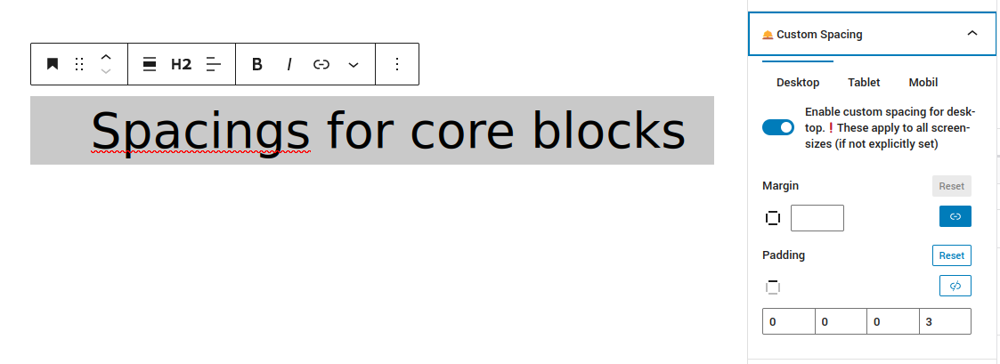

# Yours59 responsive spacings for core blocks

Wordpress Plugin provides an Panel for Gutenberg Inspector which allows you to set responsive spacing (margin, padding)
for all core blocks.

## WP Plugin Info
- **Contributors**: larslo
- **Tags**: gutenberg, gutenberg blocks, blocks, block-editor, spacings, gaps
- **Requires at least**: 5.0.0
- **Tested up to**: 6.0.1
- **License**: GPLv2 or later
- **License URI**: http://www.gnu.org/licenses/gpl-3.0.html
- **Requires PHP**: 7.4
- **Stable tag**: 1.0.1

## Description

The wordPress standard Gutenberg Sidebar \"Dimensions\" panel, does not give good control over spacings, since it only allows us to set \'fixed\' spacings (with units \"%\",\"rem\",\"vh\",\"vw\",\"px\",\"em\"). Additionally I wanted to have options to change the spacings for different screen size and have negative values possible ( e.g. removing a block-gap (`--wp--style--block-gap`) in certain scenarios).
Therefor I made this little plugin: I wanted to map the spacing set in editor to my CSS Custom Property (CSSCP) (`--size`). 
Hope this might be helpful for some others out there.

## Installation

1. Upload the plugin files to the `/wp-content/plugins/yours59-spacings-for-core-blocks` directory, or install the plugin through the WordPress plugins screen directly.
2. Activate the plugin via the \'Plugins\' screen in WordPress
3. You should see a panel in gutenberg inspector named \"Custom Spacings\"

## Frequently Asked Questions 

**Margins are not shown in editor?**

Margins will not be shown perfectly in editor. But in frontend they are supposed to work.

**I get *\"This block contains unexpected or invalid content.\"*. What can I do ?**

Be aware that installing this plugin, playing around with it and then uninstall it, will show 
*\"This block contains unexpected or invalid content.\"* on the blocks you changed. 
No worries: Pressing *Attempt Block Recovery* will work. 
There is no manipulation of existing classes or attributes. 
Plugin only injects some inline styles.

